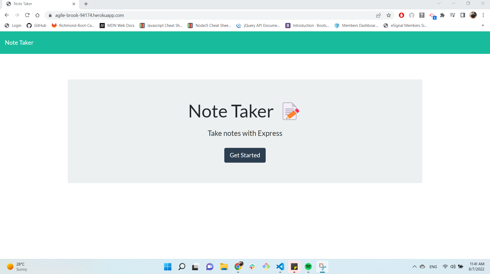
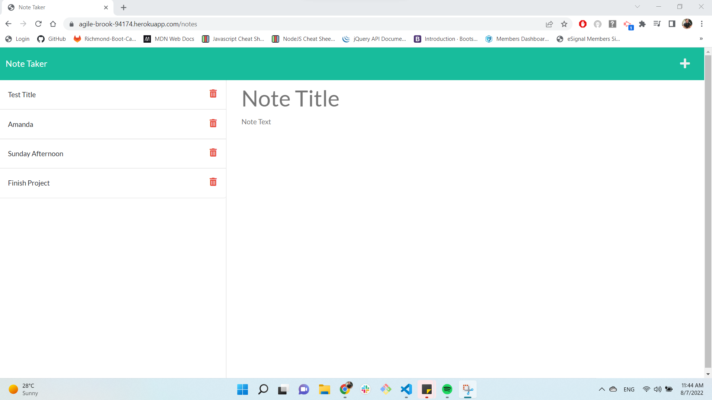

# Note Taker


## Build with:


## Description:

In this weekly module we need create an application called Note Taker that can be used to write and save notes. This application will use an Express.js back end and will save and retrieve note data from a JSON file.

## Contents

- [Installation](#installation)
- [Usage](#usage)
- [Visuals](#visuals)
- [License](#license)
- [Contributing](#contributing)
- [Tests](#tests)
- [Questions](#questions)

## Installation

1. Clone the repo
   ```sh
   git clone git@github.com:babaphillips/note-taker.git
   ```
2. Install NPM packages
   ```sh
   npm install
   ```
3. Install NPM Express package
   ```sh
   npm install express
   ```
4. Initiate application
   ```sh
   npm start
   ```

## Usage

This project can be used by individuals, groups of people or even companies to have a server where you can add and retrieves notes data from a JSON file.

## Visuals

### HomePage



### Note Taking Page



## License

This application is licensed under the MIT license.

## Contributing

Contributions are what make the open source community such an amazing place to learn, inspire, and create. Any contributions you make are welcome. If you have a suggestion that would make this better, please fork the repo and create a pull request.

1. Fork the Project
2. Create your Feature Branch (`git checkout -b feature/NewFeature`)
3. Commit your Changes (`git commit -m 'Add some NewFeature'`)
4. Push to the Branch (`git push origin feature/New`)
5. Open a Pull Request

## Tests

No tests

## Questions?

Check the deployed application here: [Heroku](https://agile-brook-94174.herokuapp.com/)

Check the GitHub repository here: [GitHub](https://github.com/babaphillips/note-taker/)

Check out my other projects at my Github here: [Github](https://github.com/babaphillips)

How To Reach Me For Additional Questions: amandavphillips@icloud.com
